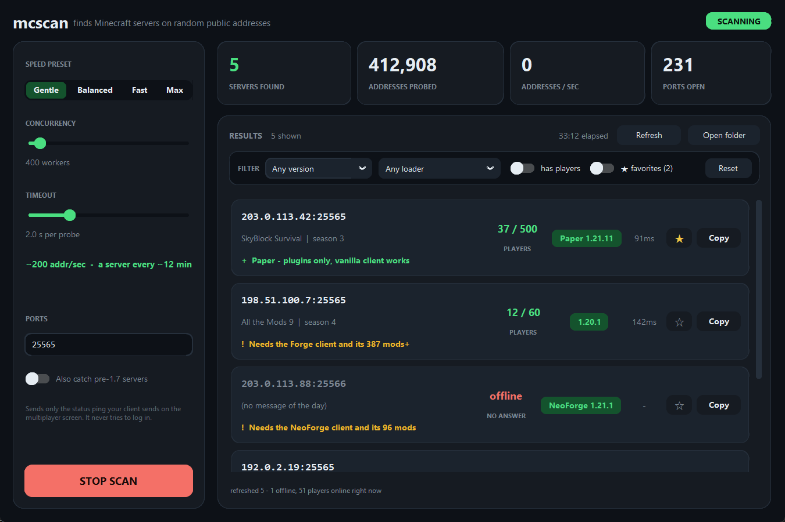

# mcscan

**Find live Minecraft servers by pinging random public IP addresses.**

For each random address, mcscan opens a TCP connection to the Minecraft port. If that
succeeds, it speaks the real **Server List Ping** protocol — the exact exchange your
client does on the multiplayer screen — so a hit is a *confirmed* Minecraft server with
its MOTD, version, mod loader and player counts, not just an open port.


> **Please read [Responsible use](#responsible-use) first.** This scans machines that
> aren't yours and the servers it finds belong to real people. It only ever sends a
> status ping — it never logs in, joins, or attacks anything — and it should stay that
> way.

<p align="center">
  
</p>

There are two front ends over one scanner:

- **`gui.py`** — a dark desktop app with live stats and filters.
- **`mcscan.py`** — the same scanner on the command line.

The scanner and CLI need **nothing but the Python standard library** (3.8+). Only the GUI
needs a package.

## Install & run

```bash
git clone https://github.com/Azed1239/mcscan.git
cd mcscan
```

**Command line — zero dependencies:**

```bash
python mcscan.py
```

**GUI:**

```bash
pip install customtkinter
python gui.py
```

Pick a speed preset, hit **START SCAN**, and servers appear newest-first as they're
found, each with a **Copy** button and a one-line note on what you'd need to join it.
Results are written to `servers.jsonl` next to the program.

### Optional: build a standalone .exe

Not committed to the repo — build it yourself:

```bash
pip install -r requirements.txt
build.bat          # Windows; wraps PyInstaller
```

The result is `dist/mcscan.exe`, which runs with no Python installed. Two heads-ups if
you share it: it's **unsigned**, so Windows SmartScreen shows a "More info → Run anyway"
prompt, and one-file PyInstaller binaries **frequently trip antivirus false positives**
(and can be quarantined outright). For anyone who can run Python, sharing the source is
smoother than sharing the binary.

## Filters (GUI)

Above the list: **version**, **loader**, and **has players online**. The header shows
`7 of 21 shown` while any filter is active, and **Reset** clears all three.

The version box is a **typeable dropdown** listing individual releases grouped under
their family:

```
Any version
1.21.x
   1.21.11
   1.21.10
   ...
   1.21.1
1.20.x
   1.20.6
```

Pick one, or just type it. A filter is matched as a **version prefix**, compared number
by number rather than as text — so `1.21.11` matches only 1.21.11, `1.21.1` matches only
1.21.1, and `1.21` (or `1.21.x`) covers the whole line. `1.2` will not catch 1.21.x.
Anything that isn't a version number falls back to a text match, so typing `Paper` or
`Folia` works too. The list is seeded with common releases and merges in every version
you actually find, so new numbering (`26.2`) appears on its own with no code change.

The loader dropdown adds two catch-alls beyond the specific loaders: **No mods (vanilla /
plugins)** for servers a stock client can join, and **Any modded** for anything needing
a loader.

Filters only hide rows — scanning and saving are unaffected, so loosening a filter brings
servers straight back without rescanning, and `servers.jsonl` always has everything.

## Favorites and refresh

**★ Star** any result to bookmark it. Favorites are kept in `favorites.json` next to the
program — deliberately *not* in `servers.jsonl`, so rewriting the results can never lose
your bookmarks. Starred servers are always loaded on startup even if they're older than
the 40 most recent results, and the **★ favorites** filter narrows the list to just them.

**Refresh** re-pings every loaded server to bring player counts up to date. Rows update
live as replies arrive, servers that no longer answer are greyed out and marked
**offline**, and the results are merged back into `servers.jsonl` — matched on ip+port,
preserving `found_at` and any records that weren't part of the refresh.

Refresh is disabled while a scan is running, on purpose: the scanner holds
`servers.jsonl` open in append mode, and rewriting the file underneath it would send its
later writes to an orphaned file.

An offline server is kept, not deleted — it's flagged `"offline": true` so you can see it
went away, and a later refresh clears the flag if it comes back.

## Command line

```bash
python mcscan.py
```

Stop with Ctrl-C. Every hit is printed and appended to `servers.jsonl`; rerunning resumes
and skips servers already in that file.

```bash
python mcscan.py --limit 10          # stop after 10 servers found
python mcscan.py --duration 600      # stop after 10 minutes
python mcscan.py -c 2000 -t 1.5      # go faster (see "Speed" below)
python mcscan.py -p 25565-25567      # try several ports per address
python mcscan.py --legacy            # also catch pre-1.7 servers
python mcscan.py --check mc.hypixel.net   # ping one known host, for testing
python mcscan.py --recheck           # re-ping saved servers, refresh their info
python mcscan.py --version
```

`--check` bypasses the scanner and prints the full status JSON for a single host — the
quickest way to confirm the protocol code works.

## Speed

A dead address burns the whole timeout, so throughput is basically
**concurrency ÷ timeout**. The default (`-c 400 -t 2`) is a deliberately gentle ~200
addresses/sec.

Measured while developing: 2,000 workers held ~1,000 addresses/sec, 4,000 sustained
~1,900. Across ~300,000 addresses the hit rate came out near **1 server per 150,000
addresses**, so at the default expect one every several minutes — and it's random, so dry
spells are normal. Turn concurrency up (GUI presets or `-c`) if you want more.

**⚠ If your own network starts stuttering, that's the concurrency.** Every in-flight
probe holds a NAT-table entry in your router, and entries for addresses that never reply
linger far longer than the timeout — so at a couple thousand workers the table runs tens
of thousands deep, past what most consumer routers hold. Once it's full the router drops
entries for your *other* traffic too. Drop back to Gentle (`-c 400`) and it clears within
a minute. This is why the default is low.

## What you need to join

Every result says what it would take to get in, because the status ping carries more than
the MOTD:

| Line | Meaning |
|---|---|
| `+ Paper - plugins only, vanilla client works` | Server-side software. Your normal client is fine. |
| `+ Vanilla - just a 1.20.1 client` | Nothing special, just that version. |
| `~ Fabric server - a vanilla client usually works` | Fabric accepts vanilla clients unless the server's mods need a client half. |
| `~ Proxy (Velocity) - the real server is behind it` | You're seeing a front end, not the game server. |
| `! Needs the Forge client and its 387 mods` | Forge/NeoForge. You need the loader **and** the matching modpack. |
| `? Mod info not recorded - rescan this one to check` | An older result from before mod detection; not a claim either way. |

Forge detection is real, not guesswork off the name. Modern Forge servers put a
`forgeData` block in the ping, 1.12-and-older send `modinfo` with type `FML`, and big
modpacks blow past the ping size limit — so Forge packs the whole list into a `d` string
at 15 bits per UTF-16 character, which mcscan unpacks too (the only way to see a 400-mod
pack). A trailing `+` means the server truncated its own list. The mod IDs (up to 40) are
saved under `mods` in `servers.jsonl`, usually enough to recognise a modpack.

What a ping **cannot** tell you: whether you're whitelisted, whether it's offline-mode, or
whether an anticheat will object — those only show up when you try. One real blind spot:
NeoForge on 1.20.2+ negotiates mods at login, not in the ping, so such a server can look
identical to vanilla. That's why a clean result reads "no mods advertised" rather than
"vanilla" — it reports what the server said, not a guarantee.

## Output

`servers.jsonl` — one JSON object per line:

```json
{"ip": "203.0.113.9", "port": 25565, "found_at": "2026-09-02T15:45:55Z",
 "version": "1.21.1", "protocol": 767, "online": 7, "max": 20,
 "motd": "Test Server - hello", "latency_ms": 42.3, "loader": null,
 "mod_count": null, "players_sample": ["Notch"], "legacy": false}
```

## How it decides something is a server

1. TCP connect to the port. Most random addresses simply time out. Some networks accept
   connections on *every* port, which is why step 2 matters.
2. Send a handshake packet (protocol version, address, port, next-state = 1) followed by
   an empty status request.
3. Read back the length-prefixed JSON status. Anything that isn't a well-formed status
   packet is discarded.
4. Optionally send a ping packet and time the pong for latency.

With `--legacy`, an address that fails step 3 gets a second try with the pre-1.7
`0xFE 0x01` ping, catching old 1.6-and-below servers. Private, loopback, CGNAT, multicast,
documentation and other reserved ranges are never generated — see `_RESERVED_CIDRS` in
the source.

## Responsible use

mcscan only ever sends a **status ping** — the one request a public Minecraft server
exists to answer. It never logs in, joins, or sends anything else. Keep it that way:

- **The servers you find are other people's.** Don't attack them, don't DDoS them, don't
  hammer them. Joining a whitelisted or private server uninvited isn't cool either.
  Booting a server offline is a computer-misuse crime in most countries, and you reached
  it from your own IP — you are not anonymous.
- **Don't publish your results file.** `servers.jsonl` is a list of real machines and is
  `.gitignore`d for that reason. Publishing it is how these tools get used for griefing.
- **Wide scanning can violate your ISP or host's AUP.** From a residential line at these
  low rates it's usually fine; from a VPS it's a good way to get an abuse email. Check
  your own terms.
- **Keep the rate sane.** One packet per host is nowhere near enough to bother anyone —
  resist cranking concurrency into the tens of thousands.

This tool is for finding servers to *play on*. Be a decent guest.

## Contributing

Issues and PRs welcome. The scanner core (`mcscan.py`) is dependency-free and has small,
testable functions — `detect_platform`, `version_matches`, `parse_forge_blob` are good
places to start. Please don't add features whose main purpose is attacking or
overwhelming the servers found.

## License

[MIT](LICENSE) © 2026 KylePine (Azed1239)
